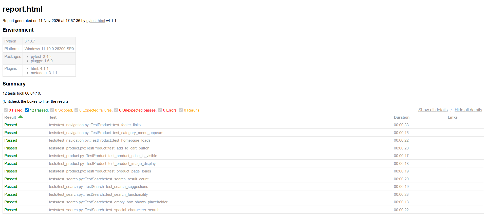

# E-commerce Test Automation Suite


## Overview
Automated testing suite for a Romanian e-commerce website (Dr.Max) using Selenium WebDriver and Pytest.

## Features
- 10+ automated test cases covering:
  - Search functionality
  - Product display
  - Navigation
  - Cart operations
- Page Object Model (POM) design pattern
- HTML test reports
- Cross-browser support

## Technologies
- Python 3.8+
- Selenium WebDriver
- Pytest
- WebDriver Manager

## Installation
```bash
# Clone repository
git clone https://github.com/AlexeiLuchian/ecommerce-test-automation.git
cd ecommerce-test-automation

# Create virtual environment
python -m venv venv
source venv/bin/activate  # On Windows: venv\Scripts\activate

# Install dependencies
pip install -r requirements.txt
```

## Running Tests
```bash
# Run all tests
pytest

# Run specific test file
pytest tests/test_search.py
```

## Test Results


## Project Structure
```
├── tests/          # Test cases
├── pages/          # Page Object Models
├── utils/          # Helper functions
├── reports/        # Test reports
└── requirements.txt
```

## Author
Alexei Luchian - Computer Science Student
- GitHub: [@AlexeiLuchian](https://github.com/AlexeiLuchian)
- LinkedIn: [Alexei Luchian](https://linkedin.com/in/alexeiluchian)

## License
MIT License